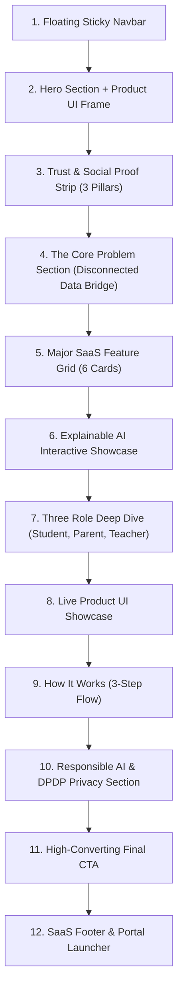

# EDU BRIDGE — SAAS LANDING PAGE DESIGN SYSTEM & WIREFRAME
### AI-Powered Student Academic & Well-Being Platform

---

## 1. DESIGN PHILOSOPHY & INSPIRATION

The EduBridge SaaS Landing Page is inspired by top-tier modern SaaS product designs (e.g. Dribbble *OnePage Modern Task Management SaaS*). It balances **premium tech aesthetics** with an **edtech/human-centered purpose**.

### Core Visual Principles
- **Atmosphere**: Off-white background (`#f8fafc`), crisp white cards (`#ffffff`), subtle borders (`#e2e8f0`), and soft multi-layered depth shadows.
- **Brand Accent**: Electric Indigo (`#4f46e5`) paired with soft Cyan (`#06b6d4`) & Emerald (`#10b981`) highlights.
- **Typography**: Clean, geometric sans-serif fonts (**Plus Jakarta Sans** for headers, **Inter** for body text).
- **Whitespace**: Generous vertical section padding (`py-24`), wide max-width containers (`max-w-7xl`), and clear visual separation.
- **Product UI as Visual Hero**: Real product interface frames replacing generic stock illustrations.

---

## 2. DESIGN SYSTEM TOKENS

```css
:root {
  /* Neutral Color Palette (Light SaaS Theme) */
  --slate-50:  #f8fafc;
  --slate-100: #f1f5f9;
  --slate-200: #e2e8f0;
  --slate-300: #cbd5e1;
  --slate-400: #94a3b8;
  --slate-600: #475569;
  --slate-700: #334155;
  --slate-800: #1e293b;
  --slate-900: #0f172a;

  /* Brand Accents */
  --primary-500: #6366f1;
  --primary-600: #4f46e5;
  --primary-700: #4338ca;

  --accent-cyan: #06b6d4;
  --accent-emerald: #10b981;
  --accent-amber: #f59e0b;
  --accent-rose: #f43f5e;

  /* Surfaces & Shadows */
  --bg-landing: var(--slate-50);
  --surface-card: #ffffff;
  --border-subtle: rgba(226, 232, 240, 0.8);
  --shadow-soft: 0 10px 30px -5px rgba(15, 23, 42, 0.05), 0 4px 6px -2px rgba(15, 23, 42, 0.02);
  --shadow-hover: 0 20px 40px -10px rgba(79, 70, 229, 0.12), 0 8px 16px -4px rgba(15, 23, 42, 0.04);

  /* Radii */
  --radius-card: 20px;
  --radius-pill: 9999px;
}
```

---

## 3. LANDING PAGE SECTION HIERARCHY



---

## 4. WIREFRAME & COMPONENT SPECIFICATIONS

### Component 1: Floating Sticky Navbar
- **Left**: EduBridge Logo with gradient badge (`EB`) + Tagline.
- **Center**: Nav items (*Features*, *How It Works*, *AI*, *For Students*, *For Parents*, *For Teachers*).
- **Right**: Secondary `Log In` link + Primary `Get Started` button.

### Component 2: Hero Section & Hero Visual
- **Headline**: `"A smarter bridge between students, parents & teachers."`
- **Subtext**: `"EduBridge combines academic tracking, daily planning, health habits, and mental well-being into one explainable AI decision-support platform."`
- **Hero Frame**: Browser window mockup showing a live EduBridge student dashboard preview with floating stat cards (*"Math Practice Recommended"*, *"Sleep + Retention Index"*).

### Component 3: Problem Section (The Disconnected Data Bridge)
- **Problem Statement**: `"Student progress shouldn't live in disconnected places."`
- **Visual Diagram**:
  - Card 1: *Student Home Habits* (Study hours, goals, mood)
  - Card 2: *Parent Observations* (Routines, sleep, screen time)
  - Card 3: *Teacher Evaluation* (Marks, attendance, participation)
  - **Central Hub**: Visual glowing arrows converging into **EduBridge Platform**.

### Component 4: Explainable AI Section
- **Headline**: `"AI that understands the student's journey."`
- **Interactive Component**: Demonstrates input variables (e.g. *Math Score dropped to 62%*, *3 pending assignments*, *Exam in 5 days*) leading to an AI Output plan with explicit **"Why this recommendation?"** evidence details.

### Component 5: Three Role Section
- **Student**: *Plan. Learn. Improve.* (Study tracker, daily schedule generator, mood check-in).
- **Parent**: *Understand. Support. Connect.* (Academic overview, home observations log, DPDP consent switches).
- **Teacher**: *Observe. Guide. Support.* (Marks uploader, evidence-based feedback, class roster).

---

## 5. TECHNICAL REACT ARCHITECTURE

```text
src/
├── components/
│   ├── Navbar.jsx
│   ├── Hero.jsx
│   ├── HeroVisual.jsx
│   ├── TrustStrip.jsx
│   ├── ProblemSection.jsx
│   ├── FeatureGrid.jsx
│   ├── AIDemo.jsx
│   ├── RoleCards.jsx
│   ├── ProductShowcase.jsx
│   ├── HowItWorks.jsx
│   ├── PrivacySection.jsx
│   ├── FinalCTA.jsx
│   └── Footer.jsx
├── landingApp.jsx
└── styles/landing.css
```
