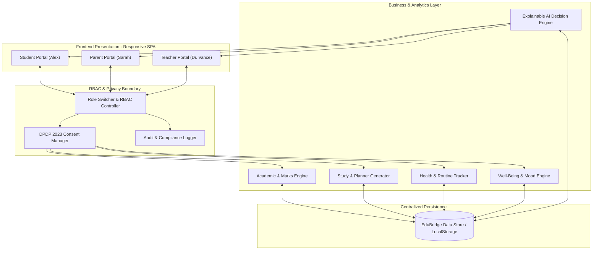
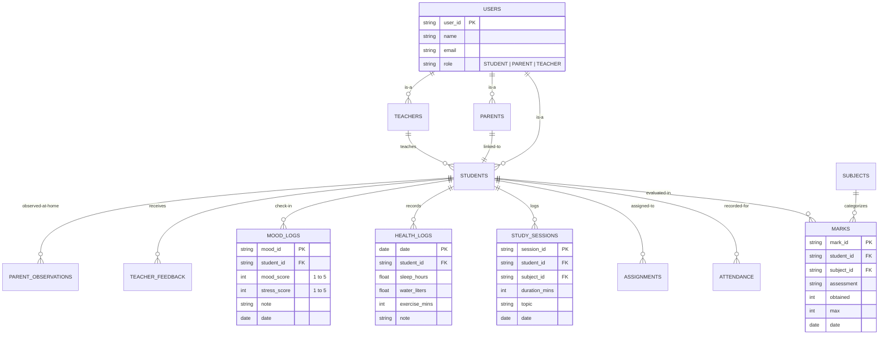
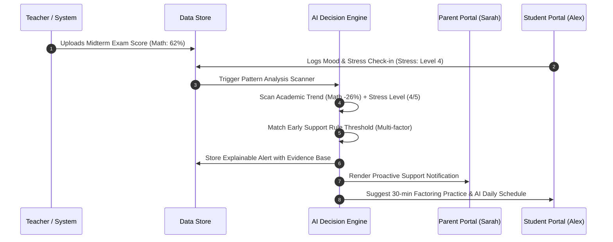

# EDU BRIDGE — MASTER ARCHITECTURAL & DESIGN DOCUMENTATION
### AI-Powered Student Academic & Well-Being Platform

---

## 1. EXECUTIVE OVERVIEW & SYSTEM VISION

**EduBridge** is a secure, role-based web application engineered to unite academic performance tracking, daily study planning, routine health habits, and mental well-being check-ins into one integrated decision-support platform.

### What We Are Building
We are building a unified ecosystem designed around **three core user roles**:
1. **Student (Alex Morgan)** — Primary beneficiary who tracks marks, records study hours, sets daily goals, logs lifestyle metrics (sleep, hydration, activity), completes mood check-ins, and receives AI study schedules.
2. **Parent (Sarah Morgan)** — Monitor and caregiver who views child academic trends, records home routine observations (study discipline, screen habits), manages privacy/consent settings, and communicates directly with teachers.
3. **Teacher (Dr. Robert Vance)** — Academic evaluator and classroom observer who enters official marks, tracks attendance, records evidence-based classroom observations, provides subject practice feedback, and reviews AI academic summaries.

> **CRITICAL ARCHITECTURAL DIRECTIVE:**  
> The system operates strictly across these **three user roles** (Student ↔ Parent ↔ Teacher). There is **NO Administrator role, login, dashboard, or endpoint** in the core application logic.

---

## 2. ARCHITECTURAL & TECHNOLOGY DECISIONS

### System Architecture Diagram

### Why This Architecture Was Selected
1. **Role-Based Decoupling**: Each portal view renders only the permitted components and data fields assigned to that active role.
2. **Explainable AI (XAI)**: Rather than opaque "black-box" machine learning predictions, the AI module utilizes deterministic rule engines with explicit **evidence traces** (e.g., *"Math score dropped by 26% over 2 tests while study hours were 0 for 3 days"*).
3. **Data Minimization & Privacy by Design**: Sensitive health and mood data are protected by explicit parental consent switches.

---

## 3. DATABASE SCHEMAS & ENTITY RELATIONSHIPS

---

## 4. DATA FLOW & AI DECISION MECHANICS

### Data Flow for AI Early Support Alerts

### Explainable AI Recommendation Rules

The AI Decision Engine evaluates data according to four transparent rules:

1. **Academic Drop Rule**:
   $$\Delta M = M_{\text{previous}} - M_{\text{latest}}$$
   If $\Delta M \ge 15\%$, generate targeted practice recommendation for that subject with evidence trace showing test names and scores.

2. **Sleep Routine Rule**:
   If sleep duration $< 6.5 \text{ hours}$ for $\ge 2$ consecutive nights, generate a bedtime rest recommendation emphasizing memory retention.

3. **Multi-Factor Support Alert Rule**:
   If $(\text{Stress Score} \ge 4) \land (\text{Pending Tasks} \ge 2) \land (\text{Academic Drop} \ge 15\%)$, generate a **Proactive Early-Support Flag** for Parent and Teacher review.

4. **Daily Timetable Generator Algorithm**:
   Allocates study time blocks into 40% focus subject, 15% active hydration rest break, 35% pending assignment execution, and 10% daily reflection.

---

## 5. PRIVACY, ETHICS & COMPLIANCE

1. **Digital Personal Data Protection (DPDP) Act 2023 Alignment**:
   - Parent consent switches control whether health data and home observations are visible to teachers.
   - All sensitive entries (mood, health) have restricted access rights.
2. **Non-Clinical & Non-Diagnostic Guarantee**:
   - The platform strictly avoids clinical medical or psychological diagnosis.
   - All AI output uses supportive, non-labeling terminology (*"proactive support suggested"*, never *"bad student"* or *"lazy"*).
3. **Evidence-Based Observations**:
   - Teachers are guided to enter observable evidence (*"Submitted 2 assignments late"*) rather than subjective labels.
4. **Auditability**:
   - Every score upload, consent policy update, and recommendation generation is logged in a non-repudiable audit ledger.

---

## 6. SYSTEM IMPLEMENTATION STATUS

The EduBridge platform has been completely implemented and deployed locally at `http://localhost:8000`:
- `index.html` — Full responsive single-page web app layout.
- `css/styles.css` — High-end cyber/dark glassmorphic UI design system.
- `js/data.js` — Reactive data store with LocalStorage persistence and initial seed database.
- `js/ai-engine.js` — Explainable AI recommendation engine and smart daily scheduler.
- `js/app.js` — Role controller, tab navigation, Chart.js visualizations, and interactive modals.
